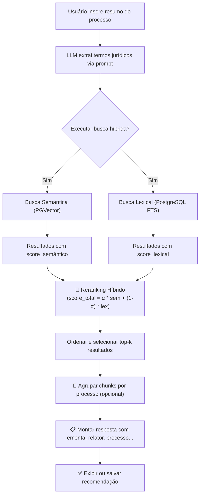

```mermaid
flowchart TD
    A[Usuário insere resumo do processo] --> B[LLM extrai termos jurídicos via prompt]
    B --> C{Executar busca híbrida?}

    C -->|Sim| D1["Busca Semântica (PGVector)"]
    C -->|Sim| D2["Busca Lexical (PostgreSQL FTS)"]

    D1 --> E[Resultados com score_semântico]
    D2 --> F[Resultados com score_lexical]

    E --> G["🔀 Reranking Híbrido<br/>(score_total = α * sem + (1-α) * lex)"]
    F --> G

    G --> H[Ordenar e selecionar top-k resultados]
    H --> I["🔗 Agrupar chunks por processo (opcional)"]
    I --> J[📋 Montar resposta com ementa, relator, processo...]

    J --> K[✅ Exibir ou salvar recomendação]

```
